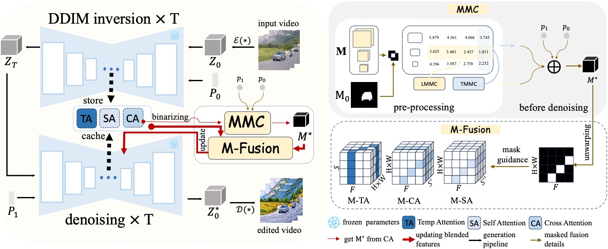

<div align="center">
<h1> FreeMask: Rethinking the Importance of Attention Masks for Zero-shot Video Editing
</h1>

<div>
    <a href="" target='_blank'>Lingling Cai</a>&emsp;
    <a href='https://scholar.google.com/citations?hl=zh-CN&user=02H8RBIAAAAJ' target='_blank'>Kang Zhao</a>&emsp;
    <a href='https://jacobyuan7.github.io/' target='_blank'>Hangjie Yuan</a>&emsp;
    <a href='https://scholar.google.com/citations?user=16RDSEUAAAAJ&hl=en' target='_blank'>Yingya Zhang</a>&emsp;
    <a href='https://scholar.google.com/citations?user=ZO3OQ-8AAAAJ&hl=en&oi=ao' target='_blank'>Shiwei Zhang</a>&emsp;
<!--     Yining Pan&emsp;<br> -->
    <a href='https://scholar.google.com/citations?hl=zh-CN&user=6tSoD98AAAAJ' target='_blank'>Kejiang Huang&#9993</a>&emsp;
</div>
    
<!-- <strong>Accepted to <a href='https://iccv2023.thecvf.com/' target='_blank'>ICCV 2023</a> :partying_face:</strong> -->

[](https://arxiv.org/abs/2209.01814)
<!-- [](https://github.com/JacobYuan7/RLIPv2)
[](https://github.com/JacobYuan7/RLIPv2)
[](https://hits.seeyoufarm.com) -->
</div>



> Abstract:
Text-to-video diffusion models have made remarkable advancements. Driven by their ability to generate temporally coherent videos, research on zero-shot video editing using these fundamental models has expanded rapidly.
To enhance editing quality, structural controls are frequently employed in video editing. Among these techniques, cross-attention mask control stands out for its effectiveness and efficiency.
However, when cross-attention masks are naively applied to video editing, they can introduce artifacts such as blurring and flickering.
Our experiments uncover a critical factor overlooked in previous video editing research: cross-attention masks are not consistently clear but vary with model structure and denoising timestep. 
To address this issue, we propose the metric Mask Matching Cost (MMC) that quantifies this variability and propose \textbf{FreeMask}, a method for selecting optimal masks tailored to specific video editing tasks.
Using MMC-selected masks, we further improve the masked fusion mechanism within comprehensive attention features, e.g., temp, cross, and self-attention modules.
Our approach can be seamlessly integrated into existing zero-shot video editing frameworks with better performance, requiring no control assistance or parameter fine-tuning but enabling adaptive decoupling of unedited semantic layouts with mask precision control. 
Extensive experiments demonstrate that FreeMask achieves superior semantic fidelity, temporal consistency, and editing quality compared to state-of-the-art methods.

## Updates
Code will be made publicly available after meticulous internal review. Stay tuned ⭐ for updates!

## Citation
```bibtex
@article{Cai2024FreeMask,
  title={FreeMask: Rethinking the Importance of Attention Masks for Zero-shot Video Editing},
  author={Lingling Cai and Kang Zhao and Hangjie Yuan and Yingya Zhang and Shiwei Zhang and Kejie Huang},
  journal={arXiv preprint arXiv:2409.20500},
  year={2024}
}
```
